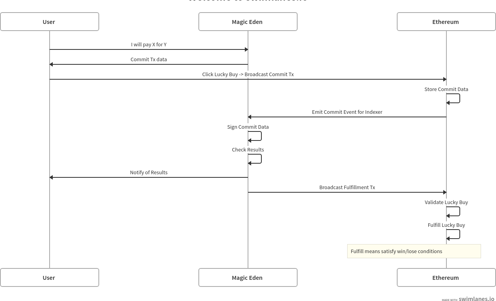

# LuckyBuy EVM Contracts

LuckyBuy is a decentralized protocol that enables probabilistic NFT purchases. Users can commit a fraction of an NFT's price for a proportional chance to win the NFT. If they win, they receive the NFT at a discount. If they don't win, they keep their committed amount.

## Overview

The protocol works in three steps:

1. **Commit**: Users commit ETH with a proportional chance to win (e.g., commit 0.1 ETH on a 1 ETH NFT for a 10% chance to win)
2. **Verify**: Trusted cosigners verify and sign valid commits
3. **Fulfill**: The protocol attempts to purchase the NFT if the user wins, or returns the ETH if they lose

### Key Features

- Trustless probability calculation based on commit amount
- Secure random number generation using signature-based PRNG
- Support for any NFT marketplace that accepts Off Chain Orders
- Fallback ETH transfer if NFT purchase fails
- Multi-cosigner support for redundancy
- Commit expiration system
- Configurable protocol fees and minimum rewards
- Access control system

## Architecture

The system consists of the following components:

### Core Contracts

- **LuckyBuy.sol**: Core contract handling commits, verification, and fulfillment
- **PRNG.sol**: Secure random number generation using commit/reveal, CRC32 and signatures

### Common Components

- **SignatureVerifier.sol**: EIP-712 compliant signature verification
- **MEAccessControl.sol**: Role-based access control system
- **CRC32.sol**: CRC32 implementation for random number generation

### Security Features

- EIP-712 structured data signing
- Unbiased random number generation
- Advanced role-based access control
- Atomic execution of NFT purchases
- Protected against signature malleability
- Commit expiration mechanism
- Configurable protocol parameters

#### Security Notes

The protocol has several critical security considerations that should be carefully reviewed:

1. **Cosigner Security**

   - The cosigner is tremendously important. If the cosigner is compromised, the protocol is compromised.
   - We discussed ways to lock down the transaction in fulfillment, including whitelisting addresses, but ultimately decided against it.
   - Regardless of whitelisting, a compromised cosigner can be used to grind different orders in different protocols (e.g., Seaport) and could still drain the contract through the commit/fulfill grinding process.
   - The attacker could simply rotate addresses they control and treat that as a nonce in the commit/reveal process.
   - We opted to leave it flexible so the order to/data/amount is arbitrary and relies on protecting our cosigner and enforcing tight key management/rotation procedures.

2. **Random Number Generation**

   - The PRNG implementation uses a combination of keccak256 and CRC32 to generate random numbers.
   - The system implements modulo bias prevention by rejecting values above MAX_CRC32_HASH_VALUE.
   - Cosigners must ensure their signature generation process is truly random and not predictable.
   - The commit/reveal scheme adds an additional layer of randomness through user-provided seeds.

3. **Balance Management**

   - The contract maintains separate balances for treasury, commits, and protocol fees.
   - Each commit's fee is tracked individually to handle fee changes gracefully.

4. **Expiration Mechanism**

   - Commits have a configurable expiration time (default 1 day).
   - The expiration mechanism prevents funds from being locked indefinitely.

5. **Access Control**

   - The contract uses a role-based access control system for administrative functions.
   - Critical functions are protected by appropriate access controls.

6. **Marketplace Interaction**

   - The contract can interact with any NFT marketplace that accepts off-chain orders.
   - This flexibility comes with risks - careful validation of marketplace interactions on web2 in the magic eden back end is crucial.
   - Failed NFT purchases must be handled gracefully to ensure user funds are returned.

7. **Front-Running Protection**
   - The commit/reveal scheme helps protect against front-running.

These security considerations should be carefully reviewed during the security audit, with particular attention to the cosigner system and random number generation implementation.
