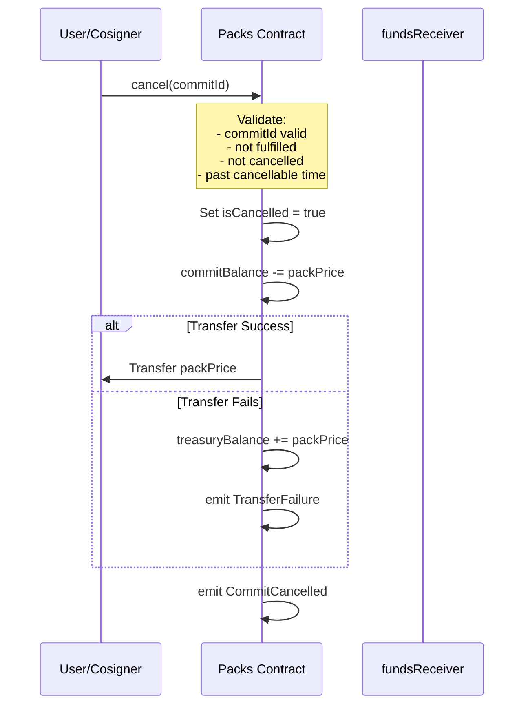
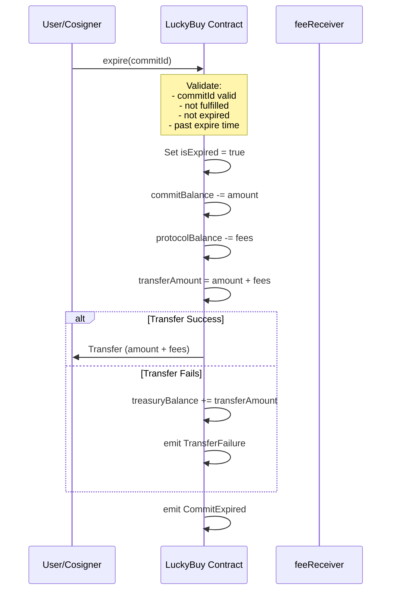
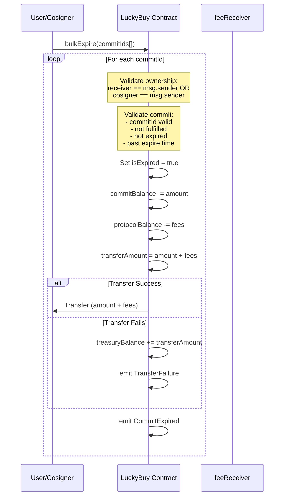

# Cancel Flow Swimlanes

## Packs Cancel Flow

## LuckyBuy Expire Flow

## LuckyBuy Bulk Expire Flow

## Key Differences Summary

| Aspect | Packs | LuckyBuy |
|--------|-------|----------|
| **Function** | `cancel()` | `expire()` / `bulkExpire()` |
| **State Flag** | `isCancelled` | `isExpired` |
| **Default Time** | 1 hour | 1 day |
| **Refund Amount** | Pack price only | Commit amount + protocol fees |
| **Balance Updates** | `commitBalance` only | Both `commitBalance` and `protocolBalance` |
| **Bulk Support** | No | Yes |
| **Fallback** | Treasury + TransferFailure event | Treasury + TransferFailure event |
