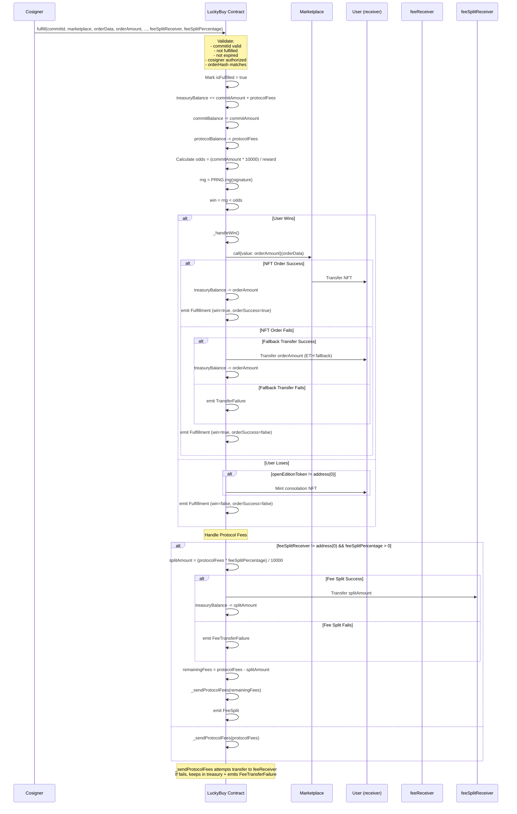
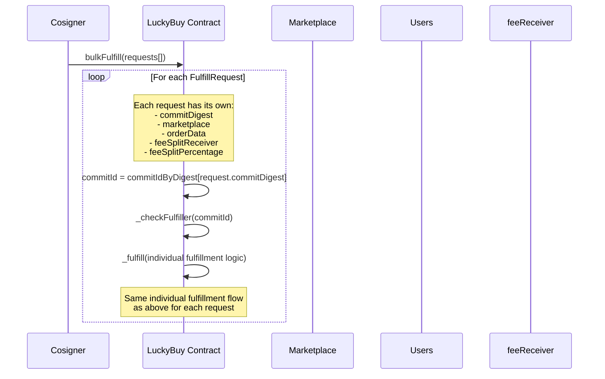

# LuckyBuy Fulfillment Flow

## LuckyBuy Individual Fulfillment Flow



## LuckyBuy Bulk Fulfillment Flow



## LuckyBuy Fee Structure Flow

```mermaid
flowchart TD
    A[User Commits Amount] --> B{Commit Type}
    
    B -->|Individual| C[Deduct flatFee<br/>Apply protocolFee]
    B -->|Bulk| D[Deduct flatFee<br/>Apply protocolFee + bulkCommitFee]
    
    C --> E[flatFee → feeReceiver immediately<br/>protocolFee → protocolBalance]
    D --> F[flatFee → feeReceiver immediately<br/>(protocolFee + bulkCommitFee) → protocolBalance]
    
    E --> G[Fulfillment Time]
    F --> G
    
    G --> H{Fee Split?}
    
    H -->|No Split| I[All protocolFees → feeReceiver<br/>via _sendProtocolFees]
    H -->|Split| J[splitAmount → feeSplitReceiver<br/>remainder → feeReceiver<br/>via _sendProtocolFees]
    
    I --> K[If transfer fails:<br/>Fees stay in treasury<br/>emit FeeTransferFailure]
    J --> K
    
    K --> L[Admin can withdraw<br/>treasury via withdraw()]
    
    style A fill:#e1f5fe
    style E fill:#fff3e0
    style F fill:#fff3e0
    style K fill:#ffebee
    style L fill:#f3e5f5
```

## LuckyBuy Treasury Management

```mermaid
flowchart TD
    A[Multiple Sources] --> B[treasuryBalance]
    
    A1[Failed flat fee transfers] --> B
    A2[Collected commit amounts] --> B
    A3[Collected protocol fees] --> B
    A4[Failed protocol fee transfers] --> B
    A5[Failed user transfers] --> B
    A6[Manual deposits via receive()] --> B
    
    B --> C{Admin Actions}
    
    C -->|withdraw(amount)| D[Transfer amount to feeReceiver<br/>treasuryBalance -= amount]
    C -->|emergencyWithdraw()| E[Transfer all balance to feeReceiver<br/>Reset all balances to 0<br/>Pause contract]
    
    D --> F[If transfer fails:<br/>revert WithdrawalFailed]
    E --> G[Contract paused<br/>All funds rescued]
    
    style B fill:#e3f2fd
    style D fill:#e8f5e8
    style E fill:#ffebee
    style F fill:#ffcdd2
    style G fill:#ffcdd2
```
