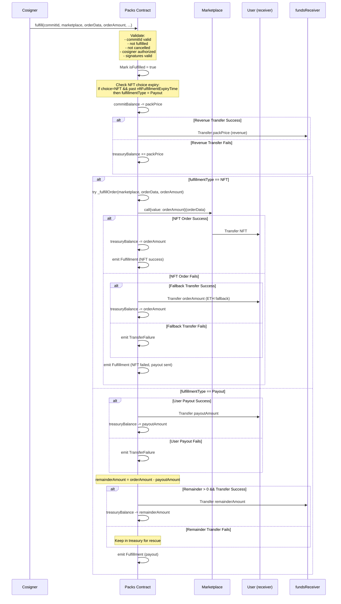
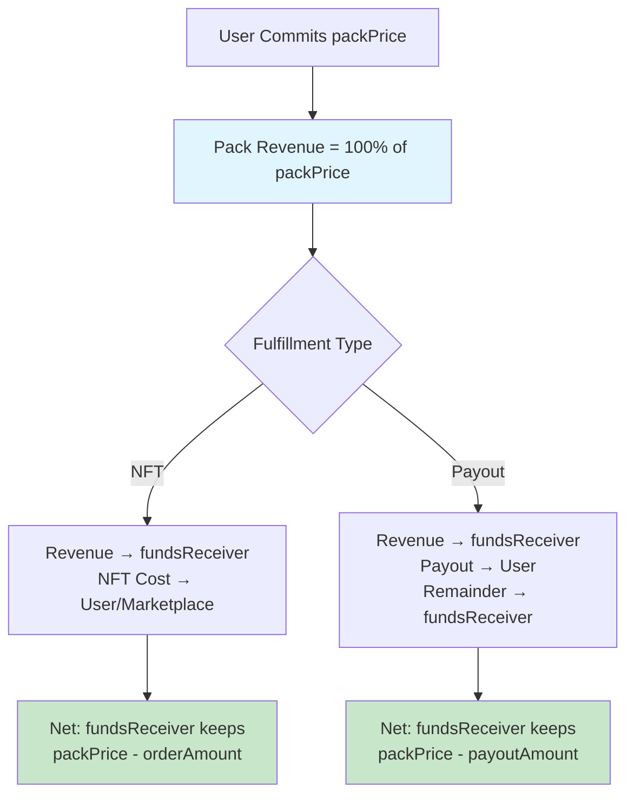

# Packs Fulfillment Flow

## Packs NFT Fulfillment Flow

```mermaid
sequenceDiagram
    participant C as Cosigner
    participant P as Packs Contract
    participant M as Marketplace
    participant U as User (receiver)
    participant F as fundsReceiver
    
    C->>P: fulfill(commitId, marketplace, orderData, orderAmount, ...)
    
    Note over P: Validate:<br/>- commitId valid<br/>- not fulfilled<br/>- not cancelled<br/>- cosigner authorized<br/>- signatures valid
    
    P->>P: Mark isFulfilled = true
    
    Note over P: Check NFT choice expiry:<br/>If choice=NFT && past nftFulfillmentExpiryTime<br/>then fulfillmentType = Payout
    
    P->>P: commitBalance -= packPrice
    
    alt Revenue Transfer Success
        P->>F: Transfer packPrice (revenue)
    else Revenue Transfer Fails
        P->>P: treasuryBalance += packPrice
    end
    
    alt fulfillmentType == NFT
        P->>P: try _fulfillOrder(marketplace, orderData, orderAmount)
        P->>M: call{value: orderAmount}(orderData)
        
        alt NFT Order Success
            M->>U: Transfer NFT
            P->>P: treasuryBalance -= orderAmount
            P->>P: emit Fulfillment (NFT success)
        else NFT Order Fails
            alt Fallback Transfer Success
                P->>U: Transfer orderAmount (ETH fallback)
                P->>P: treasuryBalance -= orderAmount
            else Fallback Transfer Fails
                P->>P: emit TransferFailure
            end
            P->>P: emit Fulfillment (NFT failed, payout sent)
        end
        
    else fulfillmentType == Payout
        alt User Payout Success
            P->>U: Transfer payoutAmount
            P->>P: treasuryBalance -= payoutAmount
        else User Payout Fails
            P->>P: emit TransferFailure
        end
        
        Note over P: remainderAmount = orderAmount - payoutAmount
        
        alt Remainder > 0 && Transfer Success
            P->>F: Transfer remainderAmount
            P->>P: treasuryBalance -= remainderAmount
        else Remainder Transfer Fails
            Note over P: Keep in treasury for rescue
        end
        
        P->>P: emit Fulfillment (payout)
    end
```

## Packs Revenue Summary

```mermaid
flowchart TD
    A[User Commits packPrice] --> B[Pack Revenue = 100% of packPrice]
    B --> C{Fulfillment Type}
    
    C -->|NFT| D[Revenue → fundsReceiver<br/>NFT Cost → User/Marketplace]
    C -->|Payout| E[Revenue → fundsReceiver<br/>Payout → User<br/>Remainder → fundsReceiver]
    
    D --> F[Net: fundsReceiver keeps<br/>packPrice - orderAmount]
    E --> G[Net: fundsReceiver keeps<br/>packPrice - payoutAmount]
    
    style B fill:#e1f5fe
    style F fill:#c8e6c9
    style G fill:#c8e6c9
```
